# Comparison of S3-Compatible Object Storage Alternatives

> **Note:** Pricing and feature claims were verified against official provider documentation as of July 2026. Superscript markers (each provider name carries a citation) link to the sources listed under [References](#references). Where the previous figures were outdated, they have been corrected inline.

## Pricing

| **Provider**               | **Free Tier Limitations**                                | **First Paid Tier / Base Cost**                       | **Storage Cost ($/GB/mo)**              | **Egress Cost ($/GB)**                        | **Minimum Retention & Key Limitations**                      |
| -------------------------- | -------------------------------------------------------- | ----------------------------------------------------- | --------------------------------------- | --------------------------------------------- | ------------------------------------------------------------ |
| **AWS S3**[^aws]                 | 5 GB, 12 mo (legacy tier; new accounts get sign-up credits since Jul 2025) | Pay-as-you-go; no base fee                            | $0.023 (first 50 TB)                    | $0.09 (first 100 GB free)                     | 30 to 180 days on colder tiers. Highly complex billing; IAM overhead. |
| **Azure Blob Storage**[^azure]     | 5 GB, 15 GB egress (12-month limit)                      | Pay-as-you-go; no base fee                            | $0.0184 (Hot, LRS)                      | $0.087 (first 100 GB/mo free)                 | 128 KiB min billable object size on Cool/Cold/Archive (phasing in 2026–27). 30/90/180 day retention on Cool/Cold/Archive. |
| **Google Cloud Storage**[^gcs]   | 5 GB storage, 100 GiB egress (NA only), 5k A / 50k B ops | Pay-as-you-go; no base fee                            | $0.020 (Standard, Regional)             | $0.08 - $0.12 (Highest of big 3)              | 30/90/365 day retention on Nearline/Coldline/Archive. Interop layer has S3 gaps. |
| **Oracle OCI**[^oci]             | 10 GB each Standard/IA/Archive (20 GB combined), 10 TB egress | Pay-as-you-go; no base fee                            | $0.0255 (Standard)                      | $0.0085 (First 10 TB/mo free)                 | 31 days (IA), 90 days (Archive). Highly generous free egress allowance. |
| **Cloudflare R2**[^r2]          | 10 GB storage, 1M Class A, 10M Class B ops/month         | Pay-as-you-go; no base fee                            | $0.015 (Standard)                       | **$0.00** (Unconditionally free)              | **No object versioning**; bucket-level WORM via Bucket Locks. Class B reads dominate static-hosting costs. |
| **Tigris**[^tigris]                 | 5 GB storage, 10k Class A, 100k Class B ops/month        | Pay-as-you-go; no base fee                            | $0.020 (Standard)                       | **$0.00** (Unconditionally free)              | 30/90 days on IA/Archive. Supports Object Lock/Versioning, dynamically placed globally. |
| **Backblaze B2**[^b2]           | 10 GB storage (Always Free)                              | Pay-as-you-go ($6/TB/mo) or B2 Reserve ($1,560/yr) | $0.006 ($6/TB)                     | $0.01 (Free up to 3x monthly storage)         | 4 global regions (US, EU, Canada). 3x egress cap can be exceeded by heavy streaming. Free API calls. |
| **Wasabi**[^wasabi]                 | 30-day trial (1 TB) only. No permanent free tier         | $7.99/mo (1 TB minimum billing floor)                 | $0.00799 ($7.99/TB)                     | **$0.00** (Subject to strict 1:1 ratio limit) | **90-day minimum retention per object.** Highly punitive for short-lived, high-churn data. |
| **IDrive e2**[^idrive]              | 10 GB storage (Always Free)                              | $2.95/mo (100 GB) or ~$5/TB base                      | $0.004 - $0.005 (~$4-5/TB)              | **$0.00** (Fair use / up to 3x limit)         | Supports Object Lock & versioning. Zero minimum retention periods. |
| **DigitalOcean Spaces**[^do]    | None                                                     | $5.00/month                                           | $0.020 (after 250 GiB included)         | $0.01 (after 1 TiB included)                  | **5 GB max single PUT; up to 5 TB per object via multipart.** |
| **Vultr Object Storage**[^vultr]   | None                                                     | $18.00/month (Standard Tier)                          | $0.018 (after 1,000 GB included)        | $0.01 (after 1,000 GB included)               | **5 GB maximum object size (hard cap; no multipart above 5 GB).** SSE-C supported; advertises >11 nines durability. |
| **Akamai / Linode**[^linode]        | None                                                     | $5.00/month                                           | $0.020 (after 250 GB included)          | $0.005 (transfer pool)                        | **5 GB max single PUT; larger objects via multipart.** |
| **Hetzner Object Storage**[^hetzner] | None                                                     | €6.49/month                                           | €0.0087 / TB-hour (after 1 TB included) | €1.00 / TB (after 1 TB included)              | EU-only regions. Prices raised April 2026 (hardware costs). Free API calls. |
| **Scaleway**[^scaleway]               | 750 GB / 90-day trial; ~75 GB egress free                | Pay-as-you-go; no base fee                            | €0.0146 (Multi-AZ) / €0.012 (One Zone)   | €0.01 (after free allowance)                      | EU-only regions. Sovereign cloud protection against CLOUD Act. |
| **OVHcloud**[^ovh]               | Varies by plan                                           | Pay-as-you-go; no base fee                            | €0.008 - €0.012 (Standard)               | **$0.00** (Egress free as of Jan 2026)        | **30-day minimum retention on all tiers.** SecNumCloud qualified options. |
| **DanubeData**[^danube]             | €50 signup credit                                        | €3.99/month                                           | €0.0039 (after 1 TB included)           | €0.0019 (after 1 TB included)                 | EU sovereign entity, no US CLOUD Act exposure. Unmetered requests. Published per-GB figures vary. |
| **Filebase**[^filebase]             | 5 GB storage, 100k Class A, 1M Class B ops/month         | Pro $7.50/mo (500 GB included) or pay-as-you-go        | $0.015 ($15/TB)                         | **$0.00** (Unconditionally free)              | **IPFS-native**; objects content-addressed (CID) with default 3x geo-redundancy across US/EU nodes. Public IPFS data is globally addressable. |
| **IPFS.ninja**[^ipfsninja]          | 1 GB storage, 500 files, 5 GB/mo gateway bandwidth       | $5.00/month (Bodhi)                                   | Plan-based (bundled)                    | Gateway bandwidth metered (up to 50 GB/gateway on paid) | **IPFS pinning service** with an S3-compatible endpoint. Signed upload tokens, dedicated gateways, and analytics. |

## Features

### Storage model, regions & API compatibility

| Provider and service                           | Storage model                                              | Global regions and availability                              | API compatibility                                            | IPFS support[^ipfs]                          |
| ---------------------------------------------- | ---------------------------------------------------------- | ------------------------------------------------------------ | ------------------------------------------------------------ | -------------------------------------------- |
| **Google Cloud Storage**[^gcs]                 | Object                                                     | Single regions plus dual- and multi-regions; US examples include **us-east1** and **us-east4**. | **Proprietary-first** (JSON/XML APIs); XML API interoperates with some S3 tooling via HMAC. | No |
| **Microsoft Azure Blob Storage**[^azure]       | Object                                                     | Global Azure regions; pricing page lists **East US**, **East US 2**, and many others. | **Proprietary REST**; not natively S3-compatible.            | No |
| **IBM Cloud Object Storage**[^ibm]             | Object                                                     | IBM documents **Cross Region**, **Regional**, and **Single Data Center** resiliency/endpoints. | **S3-compatible** API.                                       | No |
| **Oracle Cloud Infrastructure Object Storage**[^oci] | Object                                               | **Regional service** across OCI regions and availability domains. | Native Object Storage API plus **Amazon S3 Compatibility API** and Swift for RMAN use cases. | No |
| **DigitalOcean Spaces**[^do]                   | Object                                                     | Single-region buckets in selected DigitalOcean regions; transfer between regions requires copying into a new bucket. | **S3-compatible**.                                           | No |
| **Wasabi Hot Cloud Storage**[^wasabi]          | Object                                                     | Region-specific buckets across Wasabi storage regions; company pages list multiple US, EU, and APAC regions. | **S3-compatible**.                                           | No |
| **Backblaze B2 Cloud Storage**[^b2]            | Object                                                     | Multiple named regions (US, EU, Canada); docs show region-specific S3 endpoints and cross-region replication. | Native B2 API plus **S3-compatible** API.                    | No |
| **Cloudflare R2**[^r2]                         | Object                                                     | Globally distributed service with location controls/jurisdictional restrictions; S3 region is `auto`, with `us-east-1` aliasing for compatibility. | **S3-compatible**.                                           | No (public IPFS gateway deprecated 2024) |
| **MinIO self-hosted**[^minio]                  | Object                                                     | Wherever you deploy it: on premises, private cloud, Kubernetes, edge, or multi-site. | **S3-compatible**.                                           | No native; community `s3x` gateway |
| **Ceph self-hosted**[^ceph]                    | Object via RGW; Ceph platform also provides block and file | Deploy anywhere; supports multi-site object deployments.     | **S3-compatible** object API via RGW; Swift also supported.  | No native; community RADOS datastore prototype |
| **Alibaba Cloud OSS**[^alibaba]                | Object                                                     | Public OSS regions/endpoints across China, APAC, Europe, Middle East, and US regions including **US (Virginia)**. | **S3-compatible** (OSS supports S3 API operations and an S3→OSS migration path) plus the native OSS API. | No |
| **Filebase**[^filebase]                        | Object, content-addressed (CID)                            | Geo-distributed IPFS nodes across the US and Europe; every object pinned with **3x replication**. | **S3-compatible** API (bucket-level down) plus an IPFS pinning service API. | **Yes** (native, first-party)[^ipfs] |
| **IPFS.ninja**[^ipfsninja]                     | Object, content-addressed (CID)                            | Global IPFS pinning with dedicated per-project gateways.     | **S3-compatible** endpoint plus a simple REST upload API.    | **Yes** (native pinning service)[^ipfs] |

### Durability, storage classes & performance

| Provider and service                           | Durability and availability SLA                              | Typical classes and tiering                                  | Performance characteristics                                  |
| ---------------------------------------------- | ------------------------------------------------------------ | ------------------------------------------------------------ | ------------------------------------------------------------ |
| **Google Cloud Storage**                       | **11 9s annual durability**; availability varies by storage class and bucket location type. | Standard, Nearline, Coldline, Archive; **Autoclass** for automatic tiering. | Public guidance: bucket starts around **1,000 writes/s** and **5,000 reads/s**, then autoscales. |
| **Microsoft Azure Blob Storage**               | **LRS: 11 9s durability**; **GRS/GZRS: 16 9s durability**. Availability commitment varies by redundancy/access tier. | Hot, Cool, Cold, Archive; premium block blob option.         | Documented target: up to **500 requests/s (or 60 MiB/s)** for a single block blob. |
| **IBM Cloud Object Storage**                   | IBM Cloud SLO material lists **99.999% availability target** and a **14-nines (99.999999999999%) durability target**; IBM notes SLOs are distinct from formal SLAs. | Smart Tier documented in free tier; archive/accelerated archive capabilities documented; full class matrix not fully extracted. | Public performance metrics were not clearly published in accessed docs. |
| **Oracle Cloud Infrastructure Object Storage** | **11 nines durability**; Oracle has a formal OCI SLA framework, but an Object Storage-specific monthly availability figure was not extracted. | Standard, Infrequent Access, Archive.                        | Oracle describes it as “internet-scale” and “high-performance”; no universal IOPS/latency SLA published. |
| **DigitalOcean Spaces**                        | Standard-storage durability figure not extracted; **Cold Storage** documents **99.5% SLA** and the same durability as Standard. | **Standard Storage** and **Cold Storage**.                   | Spaces Cold Storage publishes **25 MB/s per client thread**, **250 MB/s per bucket**, **450 write / 250 read / 25 list RPS**. |
| **Wasabi Hot Cloud Storage**                   | Numeric durability/availability SLA was **unspecified in the accessed materials**. | Single hot tier; Wasabi explicitly markets “no complex tiers.” | No standard public IOPS/latency SLA found; Wasabi provides speed-test tooling by region. |
| **Backblaze B2 Cloud Storage**                 | Backblaze security material says infrastructure is designed for **11 nines durability**; a formal availability SLA/percentage was not extracted. | Standard hot B2 storage; **B2 Overdrive** for very high-throughput use cases. | Standard public IOPS figures were not extracted; Overdrive is marketed for terabit-class workloads. |
| **Cloudflare R2**                              | **11 nines annual durability** documented for storage classes; formal availability SLA not extracted. | Standard and Infrequent Access.                              | No universal IOPS/latency SLA published; globally distributed and tightly integrated with Workers. |
| **MinIO self-hosted**                          | **Deployment-dependent**; MinIO is software, so there is no provider-managed durability/availability SLA. | Object-only core service; ILM can tier/transition to remote S3 targets. | Highly **deployment-dependent**; MinIO provides built-in benchmarking and performance-testing tooling. |
| **Ceph self-hosted**                           | **Deployment-dependent**; no cloud-provider SLA because Ceph is self-managed software. | RGW `STANDARD` plus placement-based storage classes; lifecycle transitions and cloud transition supported. | Performance is cluster-dependent and scalable with hardware/cluster design; no single public latency SLA exists. |
| **Alibaba Cloud OSS**                          | Durability/availability values were **unspecified in the accessed materials**. | Standard LRS/ZRS, Infrequent Access, Archive, Cold Archive.  | Concurrency-friendly multipart upload is documented; no universal IOPS/latency SLA was extracted. |
| **Filebase**                                   | Redundancy via **default 3x replication** across geographically diverse IPFS nodes; no numeric durability/availability SLA published. | Single hot IPFS-backed tier; no complex class matrix.        | Access over the S3 API and IPFS gateways/CDN; no public IOPS/latency SLA. |
| **IPFS.ninja**                                 | Durability via IPFS pinning/replication; no numeric SLA published. | Single pinning tier.                                         | Dedicated gateways with analytics; no public IOPS/latency SLA. |

### Security, access control & lifecycle

| Provider and service                           | Encryption at rest and in transit                            | Access controls and IAM integration                          | Lifecycle management                                         |
| ---------------------------------------------- | ------------------------------------------------------------ | ------------------------------------------------------------ | ------------------------------------------------------------ |
| **Google Cloud Storage**                       | Server-side encryption by default; CMEK supported; TLS in transit. | Google Cloud IAM plus legacy ACLs.                           | Yes; Object Lifecycle Management and Autoclass. |
| **Microsoft Azure Blob Storage**               | Encryption at rest by default; CMK via Key Vault; encryption in transit enabled. | Microsoft Entra ID, Azure RBAC, SAS, shared key; POSIX ACLs with ADLS Gen2. | Yes; automated policies to move/delete data across Hot/Cool/Cold/Archive. |
| **IBM Cloud Object Storage**                   | Built-in encryption; customer-managed keys through **Key Protect** or **Hyper Protect Crypto Services**. | IBM Cloud IAM, bucket policies, public-access controls.      | Yes; lifecycle policies and replication. |
| **Oracle Cloud Infrastructure Object Storage** | Data encryption supported; Vault-backed key management; private and dedicated endpoints available. | OCI IAM policies; pre-authenticated access and private endpoints. | Yes; lifecycle policies for archive/delete and replication. |
| **DigitalOcean Spaces**                        | HTTPS/SigV4; **SSE-C supported**; **bucket-level default encryption not supported**. | Access keys, limited canned ACLs (`private`, `public-read`), bucket policies, team access. | Yes; time-based expiration and incomplete multipart upload cleanup; tag-based lifecycle unsupported. |
| **Wasabi Hot Cloud Storage**                   | Wasabi **automatically encrypts every uploaded object**; SSE-C also supported; TLS/API access over S3-compatible endpoints. | Bucket policies and IAM policies.                            | Yes; lifecycle rules and replication are documented. |
| **Backblaze B2 Cloud Storage**                 | Optional **SSE-B2** and **SSE-C**; TLS in transit.           | Application keys can be scoped to bucket/prefix/region/capabilities; Object Lock supported. | Yes; lifecycle settings, version retention, cloud replication, Object Lock. |
| **Cloudflare R2**                              | TLS in transit; SSE-C examples published; audit logs and bucket locks available. | Cloudflare API tokens and bucket-scoped policies; public buckets via custom domains or `r2.dev`. | Yes; lifecycle rules and bucket locks, each up to 1,000 rules. |
| **MinIO self-hosted**                          | TLS 1.2+; SSE-S3/SSE-KMS; external KMS support.              | Policy-based access control, OIDC, LDAP/AD integration.      | Yes; ILM supports expiration and remote-tier transitions. |
| **Ceph self-hosted**                           | Server-side encryption options including SSE-KMS; IAM/STS subset, bucket policies, ACLs. | RGW IAM API, STS subset, ACLs, bucket policies; OIDC patterns supported in related docs. | Yes; bucket lifecycle, cloud transition, archive sync. |
| **Alibaba Cloud OSS**                          | Access over HTTPS/custom domains is documented; broader encryption/IAM feature details were not fully extracted. | Access-control and IAM specifics were not fully extracted from the sources used here. | OSS lifecycle and multipart-upload features exist, but lifecycle detail was not fully extracted in this pass. |
| **Filebase**                                   | **Encryption at rest enabled by default**; TLS in transit (S3 API supports HTTP/2). | S3 access keys plus the IPFS pinning service API.            | Pin/unpin management; content-addressed objects are immutable by CID. |
| **IPFS.ninja**                                 | TLS in transit; private gateways available.                  | S3 keys plus **signed upload tokens** for secure client-side uploads. | Pin/unpin management; CID-addressed immutability. |

### Pricing, free tiers & explicit limits

| Provider and service                           | Data transfer costs                                          | Free tier and explicit limits                                | First paid tier pricing                                      |
| ---------------------------------------------- | ------------------------------------------------------------ | ------------------------------------------------------------ | ------------------------------------------------------------ |
| **Google Cloud Storage**                       | General internet egress commonly **$0.12/GB** for first tier to many worldwide destinations; inbound free. | **Always Free:** **5 GB-month** Standard in US regions, **5,000 Class A**, **50,000 Class B**, **100 GB/month outbound** from North America. | **$0.020/GiB-month** Standard single-region US storage; no minimum extracted. |
| **Microsoft Azure Blob Storage**               | Internet egress from NA/Europe: **first 100 GB/month free**, then **$0.087/GB** for next 10 TB on premium global network. | 12-month free-account offers exist; a standalone always-free Blob quota was not clearly documented in accessed material. | **Approximately $0.019/GB-month** Hot LRS from Microsoft’s official US regional pricing example. |
| **IBM Cloud Object Storage**                   | Transfer pricing varies by plan; IBM prominently advertises **One Rate** all-in pricing starting at **$10/TB-month**. | **Free tier:** **5 GB** of **Smart Tier** storage for **12 months**. | **$0.01/GB-month equivalent** from **$10/TB-month One Rate** starting price. |
| **Oracle Cloud Infrastructure Object Storage** | OCI networking pricing includes **first 10 TB/month outbound free** from NA/Europe/UK. | **Always Free:** **10 GB each of Standard, Infrequent Access and Archive (20 GB combined)** and **10 TB outbound/month**. | **$0.0255/GB-month** Standard; **$0.0127/GB-month** Infrequent Access; **$0.0051/GB-month** Archive. |
| **DigitalOcean Spaces**                        | Standard includes **1 TiB outbound** in base plan, then **$0.01/GiB** additional; Cold retrieval up to one full bucket/month included, then overage. | No free tier. **5 GB per single PUT; up to 5 TB per object via multipart.** | **$5/month** includes **250 GiB** storage and **1 TiB** outbound; additional Standard storage **$0.02/GiB-month**; Cold storage **$0.007/GiB-month**. |
| **Wasabi Hot Cloud Storage**                   | **No egress or API request fees** in pay-as-you-go pricing (egress subject to a 1:1 fair-use ratio). | **30-day free trial**; **90-day minimum retention per object.** | **$7.99/TB-month** ≈ **$0.0078/GB-month** (Pay-Go rate effective Jul 1 2026). |
| **Backblaze B2 Cloud Storage**                 | **Free egress up to 3× average monthly storage**, **$0.01/GB** thereafter, plus unlimited free egress to several partner CDNs/compute providers. | **10 GB free** storage. | **$6.00/TB-month** ≈ **$0.006/GB-month** pay-as-you-go; no minimum duration fee. |
| **Cloudflare R2**                              | **No egress charges** for any storage class. IA retrieval costs **$0.01/GB**. | **Free tier:** **10 GB-month**, **1M Class A**, **10M Class B**; applies only to Standard. | **$0.015/GB-month** Standard; **$0.01/GB-month** Infrequent Access; no minimum extracted. |
| **MinIO self-hosted**                          | Infrastructure/network-dependent; no software egress fee.    | **Community OSS software is free**; no hosted free-tier quota applies. | **Per-GB software price unspecified** for self-hosted use; enterprise subscription pricing not publicly rendered per GB. |
| **Ceph self-hosted**                           | Infrastructure/network-dependent.                            | **Open source**, so no provider free-tier quota or software charge. | **Per-GB software price unspecified**; commercial support depends on downstream vendors/integrators. |
| **Alibaba Cloud OSS**                          | Example pricing shows **US (Virginia) egress commonly $0.076/GB** to many destinations; some OSS-to-CDN paths are free. | **First 5 GB Standard LRS free** for new users in the listed regions. | **US (Virginia) Standard LRS:** **~$0.017/GB-month** above 5 GB; **Standard ZRS:** **~$0.020/GB-month**. |
| **Filebase**                                   | **Free egress on all plans** (no per-GB data-transfer fee).  | **Free tier:** **5 GB**, **100k Class A**, **1M Class B** requests, free egress. | **$15/TB-month** (**$0.015/GB-month**); Pro plan **$7.50/month** includes 500 GB. |
| **IPFS.ninja**                                 | Gateway bandwidth metered: **5 GB/month free**, scaling to **up to 50 GB per gateway** on paid plans. | **Free tier:** **1 GB**, **500 files**, private gateway.     | **$5/month** (Bodhi plan). |

### Ecosystem, deployment & compliance

| Provider and service                           | Notable integrations and ecosystem                          | On-premises or hybrid options                                | Compliance certifications                                    |
| ---------------------------------------------- | ------------------------------------------------------------ | ------------------------------------------------------------ | ------------------------------------------------------------ |
| **Google Cloud Storage**                       | BigQuery, Dataflow, GKE, Vertex AI, Storage Transfer Service. | Cloud-managed only; hybrid ingestion/migration via transfer services/appliances rather than a self-hosted GCS equivalent. | Broad Google Cloud compliance catalog; exact certifications vary by service and jurisdiction. |
| **Microsoft Azure Blob Storage**               | Deepest fit with Azure analytics, ADLS Gen2, Synapse, Defender, Entra, and backup tooling. | Cloud-managed only; hybrid patterns exist in broader Azure, but a public self-hosted Blob equivalent is not offered. | Broad Microsoft cloud compliance portfolio; exact list varies by cloud and scope. |
| **IBM Cloud Object Storage**                   | Strong fit with IBM Cloud, watsonx, backup/archival, and secure-key services. | Yes; IBM Cloud Object Storage Systems and IBM hybrid patterns. | Product pages emphasize security/compliance support; exact certification list was not fully extracted. |
| **Oracle Cloud Infrastructure Object Storage** | Strong OCI integration for database backup, analytics, AI, and Oracle-native workloads. | Private endpoints support OCI VCN and on-premises connectivity; data-transfer appliances/edge options also exist. | Oracle Cloud Compliance attestation catalog is broad; exact applicable certifications vary. |
| **DigitalOcean Spaces**                        | Tight fit with Droplets and the built-in Spaces CDN.         | No first-party on-prem object-storage offer.                 | DigitalOcean Trust Platform lists **SOC 2**, **SOC 3**, Global PRP, and HIPAA eligibility; colocated DC certifications include ISO/SOC/PCI artifacts. |
| **Wasabi Hot Cloud Storage**                   | Strong backup/media/partner ecosystem; commonly used as a lower-cost S3 drop-in. | Hybrid is usually through partner gateways and appliances rather than a first-party on-prem Wasabi platform. | Wasabi cites data centers certified for **SOC 2**, **ISO 27001**, and **PCI-DSS**; also advertises CJIS-related assurance. |
| **Backblaze B2 Cloud Storage**                 | Strong integration ecosystem: Veeam, Synology, rclone, Fastly, Cloudflare, LucidLink, and others. | Commonly used in hybrid backup/archive workflows through partner software and gateways. | Backblaze advertises **SOC 2 Type II**, HIPAA BAA support, PCI DSS support, GovRAMP/TX-RAMP/HECVAT-related programs. |
| **Cloudflare R2**                              | Excellent fit with Workers, custom domains, public-bucket delivery, migrations, and Iceberg-compatible data catalog tooling. | No on-prem service; hybrid strategy is usually “progressive migration” from other clouds rather than local deployment. | Compliance/documentation is through Cloudflare Trust Hub; company-wide materials reference standards such as ISO, SOC 2, and PCI DSS. |
| **MinIO self-hosted**                          | Strong with Kubernetes, AI/analytics pipelines, S3 SDK reuse, and self-managed sovereign storage. | **Yes**; this is its core use case.                          | Compliance is primarily the operator’s responsibility; MinIO provides security primitives but not a hosted certification envelope. |
| **Ceph self-hosted**                           | Best when you also want **block + file + object** in one private-cloud storage fabric. | **Yes**; core Ceph use case.                                 | Compliance is operator/integrator responsibility. |
| **Alibaba Cloud OSS**                          | Strong integration with Alibaba Cloud CDN and regional cloud services. | Hybrid/migration tooling exists in the broader OSS ecosystem, but exact on-prem option details were not fully extracted. | Compliance certifications were not fully extracted in the sources used here. |
| **Filebase**                                   | Web3/NFT and decentralized-storage ecosystem; drop-in S3 for existing tooling and dApps; IPFS pinning service API. | Cloud-managed service; no first-party on-prem product (you can run your own IPFS node separately). | Public compliance-certification list was not fully extracted from the sources used here. |
| **IPFS.ninja**                                 | Web3 developer tooling: REST + S3 API, signed upload tokens, dedicated gateways, and gateway analytics. | Cloud-managed pinning service; no on-prem offering. | Public compliance-certification list was not fully extracted from the sources used here. |

## Vendor Lock-In: Egress and the Escape Cost

The true financial burden of cloud storage is dictated by data transfer out (egress) to the internet or other cloud networks. The cost differential between network ingress, which is universally free across virtually all providers to eliminate onboarding friction, and network egress, which can range from free to over $0.12 per gigabyte, represents the largest structural billing asymmetry in modern cloud infrastructure.

| **Provider**             | **Outbound Transfer Cost (per GB)** | **Cost to Migrate 100 TB Out** | **Free Egress Allowance**     |
| ------------------------ | ----------------------------------- | ------------------------------ | ----------------------------- |
| **AWS S3**[^aws]               | $0.090 (first 10 TB)                | ~$9,000 (flat-rate upper bound; ~$8,000 blended)                        | 100 GB / month                |
| **Google Cloud Storage**[^gcs] | $0.120 (Standard Internet)          | ~$12,000                       | 100 GiB / month (NA only)     |
| **Azure Blob Storage**[^azure]   | $0.087 (first 50 TB)                | ~$8,700                        | 100 GB / month                |
| **Cloudflare R2**[^r2]        | $0.000                              | $0                             | Unlimited                     |
| **Backblaze B2**[^b2]         | $0.010 (after allowance)            | ~$1,000 (if unmitigated)       | 3x average monthly storage    |
| **Wasabi**[^wasabi]               | $0.000 (conditional)                | $0 (if within 1:1 limit)       | Equal to active stored volume |
| **Oracle OCI**[^oci]           | $0.0085 (after allowance)           | ~$765                          | 10 TB / month                 |
| **Filebase**[^filebase]         | $0.000                              | $0                             | Unlimited (free egress)       |

## Practical conclusions

A good practical default is to choose by **dominant constraint**:

```mermaid
flowchart TD
    A([Primary constraint]) --> B[Lowest managed cost]
    A --> C[No-egress public delivery]
    A --> D[Deep cloud ecosystem and compliance]
    A --> E[Self-hosted sovereignty]
    A --> F[Decentralized / content-addressed]

    B --> B1[Backblaze B2]
    B --> B2[Wasabi]
    B --> B3[DigitalOcean Spaces for smaller footprints]

    C --> C1[Cloudflare R2]
    C --> C2[Wasabi]
    C --> C3[Backblaze B2 with partner free egress]
    C --> C4[Filebase: free egress + IPFS gateways]

    D --> D1[Google Cloud Storage]
    D --> D2[Azure Blob Storage]
    D --> D3[Oracle Object Storage]
    D --> D4[IBM Cloud Object Storage]

    E --> E1[MinIO for S3-first self-hosting]
    E --> E2[Ceph for unified object-block-file platforms]

    F --> F1[Filebase: S3 API over IPFS]
    F --> F2[IPFS.ninja: S3-compatible IPFS pinning]

    classDef constraint fill:#4338ca,stroke:#312e81,color:#ffffff;
    class B,C,D,E,F constraint;
```

That decision structure reflects the evidence in the pricing, compatibility, lifecycle, and security documentation above. The report’s strongest bottom-line finding is that **the “best alternative to S3” depends less on object durability and more on the interaction between API portability, egress model, and operational responsibility**. Durability has largely converged among credible providers; what varies sharply is whether you pay in **network egress**, **control-plane differences**, or **self-hosted operations**.

## References

Sources below were consulted to verify the figures in this document (as of July 2026). Vendor pricing changes frequently — always confirm against the live pages before relying on a number.

[^aws]: AWS S3 — [pricing](https://aws.amazon.com/s3/pricing/), [Glacier storage classes](https://docs.aws.amazon.com/AmazonS3/latest/userguide/glacier-storage-classes.html), [Free Tier](https://aws.amazon.com/free/). The Free Tier was overhauled on 2025-07-15: accounts created after that date receive sign-up credits rather than the legacy 5 GB / 12-month allowance. The listed 100 TB egress (~$9,000) is a flat-rate upper bound; blended tiered pricing is closer to ~$8,000.
[^azure]: Azure Blob Storage — [pricing](https://azure.microsoft.com/en-us/pricing/details/storage/blobs/), [access tiers](https://learn.microsoft.com/en-us/azure/storage/blobs/access-tiers-overview), [redundancy & durability](https://learn.microsoft.com/en-us/azure/storage/common/storage-redundancy), [scalability targets](https://learn.microsoft.com/en-us/azure/storage/blobs/scalability-targets). Single-blob throughput target is ~500 requests/s (or 60 MiB/s). The 128 KiB minimum billable object size applies to Cool/Cold/Archive only and phases in 2026–2027.
[^gcs]: Google Cloud Storage — [pricing](https://cloud.google.com/storage/pricing), [storage classes](https://cloud.google.com/storage/docs/storage-classes), [availability & durability](https://cloud.google.com/storage/docs/availability-durability), [request rates](https://cloud.google.com/storage/docs/request-rate), [Always Free](https://cloud.google.com/free/docs/free-cloud-features).
[^oci]: Oracle OCI Object Storage — [price list](https://www.oracle.com/cloud/price-list/), [Always Free resources](https://docs.oracle.com/en-us/iaas/Content/FreeTier/freetier_topic-Always_Free_Resources.htm), [storage tiers](https://docs.oracle.com/en-us/iaas/Content/Object/Concepts/understandingstoragetiers.htm), [S3 Compatibility API](https://docs.oracle.com/en-us/iaas/Content/Object/Tasks/s3compatibleapi.htm). Infrequent Access is $0.0127/GB-month (not $0.01). Some 2026 secondary reports describe globally free egress, but Oracle's official price list still lists the 10 TB-free + $0.0085/GB structure.
[^r2]: Cloudflare R2 — [pricing](https://developers.cloudflare.com/r2/pricing/), [Bucket Locks (WORM retention)](https://developers.cloudflare.com/r2/buckets/bucket-locks/), [object lifecycles](https://developers.cloudflare.com/r2/buckets/object-lifecycles/), [product page](https://www.cloudflare.com/products/r2/). R2 still lacks S3-style object versioning but now offers bucket-level WORM via Bucket Locks (up to 1,000 rules).
[^tigris]: Tigris — [pricing](https://www.tigrisdata.com/pricing/), [product docs / storage tiers](https://www.tigrisdata.com/docs/).
[^b2]: Backblaze B2 — [pricing](https://www.backblaze.com/cloud-storage/pricing), [B2 Reserve](https://www.backblaze.com/cloud-storage/pricing/b2-reserve), [data regions](https://www.backblaze.com/docs/cloud-storage-data-regions), [durability](https://help.backblaze.com/hc/en-us/articles/218485257-B2-Resiliency-Durability-and-Availability). Pay-as-you-go is $6/TB-month ($0.006/GB); the $6.95/TB figure is the separate B2 Overdrive rate. There are now 4 regions (US-West, US-East, EU-Central, Canada East).
[^wasabi]: Wasabi — [pricing](https://wasabi.com/pricing), [compliance](https://wasabi.com/cloud-object-storage/compliance). The pay-as-you-go rate rose to $7.99/TB-month effective 2026-07-01 (previously $6.99/TB).
[^idrive]: IDrive e2 — [pricing](https://www.idrive.com/s3-storage-e2/pricing), [Object Lock](https://www.idrive.com/s3-storage-e2/object-lock). Object Lock (WORM immutability) and bucket versioning are both supported.
[^do]: DigitalOcean Spaces — [pricing](https://docs.digitalocean.com/products/spaces/details/pricing/), [limits](https://docs.digitalocean.com/products/spaces/details/limits/), [Cold Storage SLA](https://www.digitalocean.com/sla/spaces-cold-storage). 5 GB is the maximum single-PUT size; objects up to 5 TB are supported via multipart upload.
[^vultr]: Vultr Object Storage — [product](https://www.vultr.com/products/object-storage/), [billing](https://docs.vultr.com/support/platform/billing/how-is-object-storage-billed), [limits](https://docs.vultr.com/products/cloud-storage/object-storage/limits), [SSE-C guide](https://docs.vultr.com/how-to-use-server-side-encryption-sse-c-with-s3-object-storage-on-vultr). Vultr enforces a hard 5 GB per-object cap (no multipart above 5 GB), supports SSE-C, and advertises >11 nines durability.
[^linode]: Akamai / Linode Object Storage — [pricing](https://techdocs.akamai.com/cloud-computing/docs/object-storage-pricing), [product limits](https://techdocs.akamai.com/cloud-computing/docs/object-storage-product-limits), [network transfer](https://techdocs.akamai.com/cloud-computing/docs/network-transfer-usage-and-costs). 5 GB is the single-upload limit; larger objects are supported via multipart.
[^hetzner]: Hetzner Object Storage — [product](https://www.hetzner.com/storage/object-storage/), [FAQ](https://docs.hetzner.com/storage/object-storage/faq/general/). Billed per TB-hour; base and usage prices were raised effective 2026-04-01, citing hardware costs.
[^scaleway]: Scaleway Object Storage — [pricing](https://www.scaleway.com/en/pricing/storage/), [FAQ](https://www.scaleway.com/en/docs/object-storage/faq/). The former 75 GB always-free storage was replaced by a 750 GB / 90-day trial; a small monthly free egress allowance persists. Scaleway's IPFS Pinning service stopped accepting new data on 2024-11-27.
[^ovh]: OVHcloud Object Storage — [product](https://www.ovhcloud.com/en/public-cloud/object-storage/), [storage classes](https://www.ovhcloud.com/en/public-cloud/object-storage/classes/), [prices](https://www.ovhcloud.com/en/public-cloud/prices/). Egress became free across all classes/regions effective the January 2026 invoice.
[^danube]: DanubeData — [storage](https://danubedata.ro/solutions/storage), [pricing](https://danubedata.ro/pricing). A small EU (Romanian) provider running MinIO in an EU datacenter; its published per-GB figures and base price vary across its own pages (€3.99–€5.49/mo), so treat the listed numbers as approximate.
[^ibm]: IBM Cloud Object Storage — [docs](https://cloud.ibm.com/docs/cloud-object-storage), [resiliency (14-nines durability)](https://www.ibm.com/products/cloud-object-storage/resiliency), [One Rate plan](https://www.ibm.com/new/announcements/get-predictable-low-cost-cloud-object-storage-for-active-workloads-with-the-one-rate-plan). The $10/TB One Rate began as a promotion; confirm the current standing rate.
[^minio]: MinIO — [S3 compatibility](https://min.io/product/s3-compatibility), [identity & access management](https://min.io/docs/minio/linux/administration/identity-access-management.html), [object lifecycle management](https://min.io/docs/minio/linux/administration/object-management/object-lifecycle-management.html).
[^ceph]: Ceph RADOS Gateway — [S3 API](https://docs.ceph.com/en/latest/radosgw/s3/), [encryption](https://docs.ceph.com/en/latest/radosgw/encryption/), [STS](https://docs.ceph.com/en/latest/radosgw/STS/).
[^alibaba]: Alibaba Cloud OSS — [regions & endpoints](https://www.alibabacloud.com/help/en/oss/user-guide/regions-and-endpoints), [S3 migration / compatibility](https://www.alibabacloud.com/help/en/object-storage-service/latest/seamlessly-migrate-data-from-amazon-s3-to-alibaba-cloud-oss), [storage fees](https://www.alibabacloud.com/help/en/oss/storage-fees). OSS is S3-compatible for core API operations and documents an S3→OSS migration path.
[^ipfs]: IPFS = [InterPlanetary File System](https://ipfs.tech/). Two surveyed providers offer first-party native IPFS storage behind an S3-compatible API: **Filebase** and **IPFS.ninja**. Among the general-purpose S3 providers, none offer native IPFS. Closest options there: MinIO via the community [`s3x`](https://github.com/RTradeLtd/s3x) gateway; Ceph via a community RADOS datastore prototype; Cloudflare's public IPFS gateways were [deprecated in 2024](https://blog.cloudflare.com/cloudflares-public-ipfs-gateways-and-supporting-interplanetary-shipyard/); Scaleway's IPFS Pinning stopped accepting new data on 2024-11-27. Any provider can, of course, host a self-managed IPFS node on its compute.
[^filebase]: Filebase — [home](https://filebase.com/), [object storage & pricing](https://filebase.com/object-storage/), [docs](https://filebase.com/docs/). S3-compatible object storage that writes to IPFS with default 3x geo-redundancy across US/EU nodes; **$15/TB-month ($0.015/GB) with free egress**; free tier of 5 GB (100k Class A, 1M Class B requests). Encryption at rest and in transit enabled by default.
[^ipfsninja]: IPFS.ninja — [S3 compatibility](https://ipfs.ninja/docs/api/s3-compatibility), [home](https://ipfs.ninja/). IPFS pinning service exposing a simple REST upload API plus an S3-compatible endpoint; free tier of 1 GB / 500 files with 5 GB/month gateway bandwidth; paid plans from **$5/month (Bodhi)**, gateway bandwidth scaling to ~50 GB per gateway. Features signed upload tokens, dedicated gateways, and analytics.
