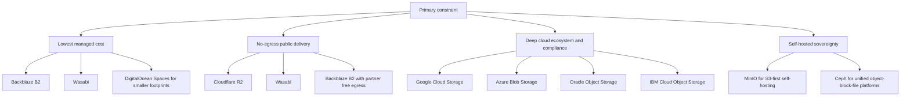

# Comparison of S3-Compatible Object Storage Alternatives

## Pricing

| **Provider**               | **Free Tier Limitations**                                | **First Paid Tier / Base Cost**                       | **Storage Cost ($/GB/mo)**              | **Egress Cost ($/GB)**                        | **Minimum Retention & Key Limitations**                      |
| -------------------------- | -------------------------------------------------------- | ----------------------------------------------------- | --------------------------------------- | --------------------------------------------- | ------------------------------------------------------------ |
| **AWS S3**                 | 5 GB storage (12-month limit for new accounts)           | Pay-as-you-go; no base fee                            | $0.023 (first 50 TB)                    | $0.09 (first 100 GB free)                     | 30 to 180 days on colder tiers. Highly complex billing; IAM overhead. |
| **Azure Blob Storage**     | 5 GB, 15 GB egress (12-month limit)                      | Pay-as-you-go; no base fee                            | $0.0184 (Hot, LRS)                      | $0.087 (Premium)                              | 128 KiB min object size. 30/90/180 day retention on Cool/Cold/Archive. |
| **Google Cloud Storage**   | 5 GB storage, 100 GiB egress (NA only), 5k A / 50k B ops | Pay-as-you-go; no base fee                            | $0.020 (Standard, Regional)             | $0.08 - $0.12 (Highest of big 3)              | 30/90/365 day retention on Nearline/Coldline/Archive. Interop layer has S3 gaps. |
| **Oracle OCI**             | 20 GB Standard, 20 GB Archive, 10 TB global egress       | Pay-as-you-go; no base fee                            | $0.0255 (Standard)                      | $0.0085 (First 10 TB/mo free)                 | 31 days (IA), 90 days (Archive). Highly generous free egress allowance. |
| **Cloudflare R2**          | 10 GB storage, 1M Class A, 10M Class B ops/month         | Pay-as-you-go; no base fee                            | $0.015 (Standard)                       | **$0.00** (Unconditionally free)              | **No Versioning, No Object Lock.** Not WORM compliant. Class B reads dominate static hosting costs. |
| **Tigris**                 | 5 GB storage, 10k Class A, 100k Class B ops/month        | Pay-as-you-go; no base fee                            | $0.020 (Standard)                       | **$0.00** (Unconditionally free)              | 30/90 days on IA/Archive. Supports Object Lock/Versioning, dynamically placed globally. |
| **Backblaze B2**           | 10 GB storage (Always Free)                              | Pay-as-you-go ($6.95/TB/mo) or B2 Reserve ($1,560/yr) | $0.00695 ($6.95/TB)                     | $0.01 (Free up to 3x monthly storage)         | Only 3 global regions. 3x egress cap can be exceeded by heavy streaming. Free API calls. |
| **Wasabi**                 | 30-day trial (1 TB) only. No permanent free tier         | $7.99/mo (1 TB minimum billing floor)                 | $0.00799 ($7.99/TB)                     | **$0.00** (Subject to strict 1:1 ratio limit) | **90-day minimum retention per object.** Highly punitive for short-lived, high-churn data. |
| **IDrive e2**              | 10 GB storage (Always Free)                              | $2.95/mo (100 GB) or ~$5/TB base                      | $0.004 - $0.005 (~$4-5/TB)              | **$0.00** (Fair use / up to 3x limit)         | No versioning, No Object Lock. Zero minimum retention periods. |
| **DigitalOcean Spaces**    | None                                                     | $5.00/month                                           | $0.020 (after 250 GiB included)         | $0.01 (after 1 TiB included)                  | **5 GB maximum object size.** Fails on large database/video multipart uploads. |
| **Vultr Object Storage**   | None                                                     | $18.00/month (Standard Tier)                          | $0.018 (after 1,000 GB included)        | $0.01 (after 1,000 GB included)               | **5 GB maximum object size.** No SSE support; durability not publicly verifiable. |
| **Akamai / Linode**        | None                                                     | $5.00/month                                           | $0.020 (after 250 GB included)          | $0.005 (transfer pool)                        | **5 GB maximum object size.** No multipart support above 5 GB. |
| **Hetzner Object Storage** | None                                                     | €6.49/month                                           | €0.0087 / TB-hour (after 1 TB included) | €1.00 / TB (after 1 TB included)              | EU-only regions. Prices updated April 2026 due to hardware costs. Free API calls. |
| **Scaleway**               | 75 GB storage, 75 GB egress (Always Free)                | Pay-as-you-go; no base fee                            | €0.016 (Multi-AZ) / €0.008 (One Zone)   | €0.01 (after 75 GB free)                      | EU-only regions. Sovereign cloud protection against CLOUD Act. |
| **OVHcloud**               | Varies by plan                                           | Pay-as-you-go; no base fee                            | €0.007 - €0.01 (Standard)               | **$0.00** (Egress free as of Jan 2026)        | **30-day minimum retention on all tiers.** SecNumCloud qualified options. |
| **DanubeData**             | €50 signup credit                                        | €3.99/month                                           | €0.0039 (after 1 TB included)           | €0.0019 (after 1 TB included)                 | EU sovereign entity, no US CLOUD Act exposure. Unmetered requests. |

## Features

| Provider and service                           | Storage model                                              | Global regions and availability                              | API compatibility                                            | Durability and availability SLA                              | Typical classes and tiering                                  | Encryption at rest and in transit                            | Access controls and IAM integration                          | Lifecycle management                                         | Performance characteristics                                  | Data transfer costs                                          | Free tier and explicit limits                                | First paid tier pricing                                      | Notable integrations and ecosystem                           | On-premises or hybrid options                                | Compliance certifications                                    |
| ---------------------------------------------- | ---------------------------------------------------------- | ------------------------------------------------------------ | ------------------------------------------------------------ | ------------------------------------------------------------ | ------------------------------------------------------------ | ------------------------------------------------------------ | ------------------------------------------------------------ | ------------------------------------------------------------ | ------------------------------------------------------------ | ------------------------------------------------------------ | ------------------------------------------------------------ | ------------------------------------------------------------ | ------------------------------------------------------------ | ------------------------------------------------------------ | ------------------------------------------------------------ |
| **Google Cloud Storage**                       | Object                                                     | Single regions plus dual- and multi-regions; US examples include **us-east1** and **us-east4**. | **Proprietary-first** (JSON/XML APIs); XML API interoperates with some S3 tooling via HMAC. | **11 9s annual durability**; availability varies by storage class and bucket location type. | Standard, Nearline, Coldline, Archive; **Autoclass** for automatic tiering. | Server-side encryption by default; CMEK supported; TLS in transit. | Google Cloud IAM plus legacy ACLs.                           | Yes; Object Lifecycle Management and Autoclass.              | Public guidance: bucket starts around **1,000 writes/s** and **5,000 reads/s**, then autoscales. | General internet egress commonly **$0.12/GB** for first tier to many worldwide destinations; inbound free. | **Always Free:** **5 GB-month** Standard in US regions, **5,000 Class A**, **50,000 Class B**, **100 GB/month outbound** from North America. | **$0.020/GiB-month** Standard single-region US storage; no minimum extracted. | BigQuery, Dataflow, GKE, Vertex AI, Storage Transfer Service. | Cloud-managed only; hybrid ingestion/migration via transfer services/appliances rather than a self-hosted GCS equivalent. | Broad Google Cloud compliance catalog; exact certifications vary by service and jurisdiction. |
| **Microsoft Azure Blob Storage**               | Object                                                     | Global Azure regions; pricing page lists **East US**, **East US 2**, and many others. | **Proprietary REST**; not natively S3-compatible.            | **LRS: 11 9s durability**; **GRS/GZRS: 16 9s durability**. Availability commitment varies by redundancy/access tier; exact current per-tier SLA not fully extracted from static crawl. | Hot, Cool, Cold, Archive; premium block blob option.         | Encryption at rest by default; CMK via Key Vault; encryption in transit enabled. | Microsoft Entra ID, Azure RBAC, SAS, shared key; POSIX ACLs with ADLS Gen2. | Yes; automated policies to move/delete data across Hot/Cool/Cold/Archive. | Published targets include up to **3,000 requests/s** for a single block blob. | Internet egress from North America/Europe: **first 100 GB/month free**, then **$0.087/GB** for next 10 TB on premium global network. | No Blob-specific perpetual free tier was found in accessed docs; Azure free account and trial offers exist, but a standalone always-free Blob quota was not clearly documented in the material accessed. | **Approximately $0.019/GB-month** Hot LRS from Microsoft’s official US regional pricing example; exact East US figure was not rendered in static crawl. | Deepest fit with Azure analytics, ADLS Gen2, Synapse, Defender, Entra, and backup tooling. | Cloud-managed only; hybrid patterns exist in broader Azure, but a public self-hosted Blob equivalent is not offered. | Broad Microsoft cloud compliance portfolio; exact list varies by cloud and scope. |
| **IBM Cloud Object Storage**                   | Object                                                     | IBM documents **Cross Region**, **Regional**, and **Single Data Center** resiliency/endpoints. | **S3-compatible** API.                                       | IBM Cloud SLO material lists **99.999% availability target** and **99.999999999999% durability target**; IBM notes SLOs are distinct from formal SLAs. | Smart Tier documented in free tier; archive/accelerated archive capabilities are documented, but full class matrix was not fully extracted. | Built-in encryption; customer-managed keys through **Key Protect** or **Hyper Protect Crypto Services**. | IBM Cloud IAM, bucket policies, public-access controls.      | Yes; lifecycle policies and replication.                     | Public performance metrics were not clearly published in accessed docs. | Transfer pricing varies by plan; IBM prominently advertises **One Rate** all-in pricing starting at **$10/TB-month**. | **Free tier:** **5 GB** of **Smart Tier** storage for **12 months**. | **$0.01/GB-month equivalent** from **$10/TB-month One Rate** starting price; Standard PAYG exact per-GB figure was not rendered in static crawl. | Strong fit with IBM Cloud, watsonx, backup/archival, and secure-key services. | Yes; IBM Cloud Object Storage Systems and IBM hybrid patterns. | Product pages emphasize security/compliance support; exact certification list was not fully extracted. |
| **Oracle Cloud Infrastructure Object Storage** | Object                                                     | **Regional service** across OCI regions and availability domains. | Native Object Storage API plus **Amazon S3 Compatibility API** and Swift for RMAN use cases. | **11 nines durability**; Oracle has a formal OCI SLA framework, but an Object Storage-specific monthly availability figure was not extracted in accessible lines. | Standard, Infrequent Access, Archive.                        | Data encryption supported; Vault-backed key management; private endpoints and dedicated endpoints available. | OCI IAM policies; pre-authenticated access and private endpoints. | Yes; lifecycle policies for archive/delete and replication.  | Oracle describes it as “internet-scale” and “high-performance”; no universal IOPS/latency SLA published in accessed docs. | OCI networking pricing includes **first 10 TB/month outbound free** from North America/Europe/UK; higher tiers were not fully rendered in the crawl. | **Always Free:** **10 GB object storage** and **10 TB outbound/month**. | **$0.0255/GB-month** Standard from Oracle price-list snippet; **$0.01/GB-month** Infrequent Access is visible in the price list. | Strong OCI integration for database backup, analytics, AI, and Oracle-native workloads. | Private endpoints support OCI VCN and on-premises connectivity; data-transfer appliances/edge options also exist in OCI broader tooling. | Oracle Cloud Compliance attestation catalog is broad; exact applicable certifications vary. |
| **DigitalOcean Spaces**                        | Object                                                     | Single-region buckets in selected DigitalOcean regions; transfer between regions requires copying into a new bucket. | **S3-compatible**.                                           | Standard-storage durability figure not extracted; **Cold Storage** explicitly documents **99.5% SLA** and the same durability as Standard in DigitalOcean docs. | **Standard Storage** and **Cold Storage**.                   | HTTPS/SigV4; **SSE-C supported**; **bucket-level default encryption not supported**. | Access keys, limited canned ACLs (`private`, `public-read`), bucket policies, team access. | Yes; time-based expiration and incomplete multipart upload cleanup; tag-based lifecycle unsupported. | Spaces Cold Storage publishes **25 MB/s per client thread**, **250 MB/s per bucket**, **450 write / 250 read / 25 list RPS**. | Standard includes **1 TiB outbound** in base plan, then **$0.01/GiB** additional transfer; Cold retrieval up to one full bucket retrieval per month is included, then overage applies. | No free tier identified in accessed docs.                    | **$5/month** includes **250 GiB** storage and **1 TiB** outbound; additional Standard storage **$0.02/GiB-month**; Cold storage **$0.007/GiB-month**. | Tight fit with Droplets and the built-in Spaces CDN.         | No first-party on-prem object-storage offer.                 | DigitalOcean Trust Platform lists **SOC 2**, **SOC 3**, Global PRP, and HIPAA eligibility; colocated DC certifications include ISO/SOC/PCI artifacts. |
| **Wasabi Hot Cloud Storage**                   | Object                                                     | Region-specific buckets across Wasabi storage regions; company pages list multiple US, EU, and APAC regions. | **S3-compatible**.                                           | Numeric durability/availability SLA was **unspecified in the accessed materials**. | Single hot tier; Wasabi explicitly markets “no complex tiers.” | Wasabi says it **automatically encrypts every uploaded object**; SSE-C also supported; TLS/API access over S3-compatible endpoints. | Bucket policies and IAM policies.                            | Yes; lifecycle rules and replication are documented.         | No standard public IOPS/latency SLA found; Wasabi provides speed-test tooling by region. | **No egress or API request fees** in pay-as-you-go pricing page. | **30-day free trial** is advertised; explicit trial capacity limits were not extracted. | **$7.99/TB-month** ≈ **$0.0078/GB-month**.                   | Strong backup/media/partner ecosystem; commonly used as a lower-cost S3 drop-in. | Hybrid is usually through partner gateways and appliances rather than a first-party on-prem Wasabi object platform. | Wasabi’s storage-region page cites secure/redundant data centers certified for **SOC 2**, **ISO 27001**, and **PCI-DSS**; Wasabi also advertises CJIS-related assurance. |
| **Backblaze B2 Cloud Storage**                 | Object                                                     | Multiple named regions; docs/examples show region-specific S3 endpoints and replication between regions. | Native B2 API plus **S3-compatible** API.                    | Backblaze security material says infrastructure is designed for **11 nines durability**; a formal availability SLA/percentage was not extracted in accessed docs. | Standard hot B2 storage; **B2 Overdrive** for very high-throughput use cases. | Optional **SSE-B2** and **SSE-C**; TLS in transit.           | Application keys can be scoped to bucket/prefix/region/capabilities; Object Lock supported. | Yes; lifecycle settings, version retention, cloud replication, Object Lock. | Standard public IOPS figures were not extracted; Overdrive is marketed for very high throughput and terabit-class workloads. | Current Backblaze public pricing emphasizes **free egress up to 3× average monthly storage**, **$0.01/GB** thereafter, and unlimited free egress to several partner CDNs/compute providers. | **10 GB free** storage; public pricing currently emphasizes free-egress policy rather than a large fixed monthly egress quota. | **$6.95/TB-month** ≈ **$0.0068/GB-month**; no minimum duration fee noted on pricing page. | Strong integration ecosystem: Veeam, Synology, rclone, Fastly, Cloudflare, LucidLink, and others. | Commonly used in hybrid backup/archive workflows through partner software and gateways. | Backblaze advertises **SOC 2 Type II**, HIPAA BAA support, PCI DSS support, GovRAMP/TX-RAMP/HECVAT-related programs. |
| **Cloudflare R2**                              | Object                                                     | Globally distributed service with location controls/jurisdictional restrictions; S3 region is `auto`, with `us-east-1` aliasing for compatibility. | **S3-compatible**.                                           | **11 nines annual durability** documented for storage classes; formal availability SLA not extracted. | Standard and Infrequent Access.                              | TLS in transit; SSE-C examples published; audit logs and bucket locks available. | Cloudflare API tokens and bucket-scoped policies; public buckets via custom domains or `r2.dev`. | Yes; lifecycle rules and bucket locks, each up to 1,000 rules. | No universal IOPS/latency SLA published; globally distributed and tightly integrated with Workers. | **No egress charges** for any storage class. IA retrieval costs **$0.01/GB**. | **Free tier:** **10 GB-month**, **1M Class A**, **10M Class B**; applies only to Standard. | **$0.015/GB-month** Standard; **$0.01/GB-month** Infrequent Access; no minimum extracted. | Excellent fit with Workers, custom domains, public-bucket delivery, migrations, and Iceberg-compatible data catalog tooling. | No on-prem service; hybrid strategy is usually “progressive migration” from other clouds rather than local deployment. | Compliance/documentation is through Cloudflare Trust Hub; company-wide materials reference standards such as ISO, SOC 2, and PCI DSS. |
| **MinIO self-hosted**                          | Object                                                     | Wherever you deploy it: on premises, private cloud, Kubernetes, edge, or multi-site. | **S3-compatible**.                                           | **Deployment-dependent**; MinIO is software, so there is no provider-managed durability/availability SLA for a self-hosted OSS deployment. | Object-only core service; ILM can tier/transition to remote S3 targets. | TLS 1.2+; SSE-S3/SSE-KMS; external KMS support.              | Policy-based access control, OIDC, LDAP/AD integration.      | Yes; ILM supports expiration and remote-tier transitions.    | Highly **deployment-dependent**; MinIO provides built-in benchmarking and performance-testing tooling rather than a single published service SLA. | Infrastructure/network-dependent; no software egress fee.    | **Community OSS software is free**; no hosted free-tier quota applies. | **Per-GB software price unspecified** for self-hosted use; enterprise subscription pricing is not publicly rendered per GB in accessed docs. | Strong with Kubernetes, AI/analytics pipelines, S3 SDK reuse, and self-managed sovereign storage. | **Yes**; this is its core use case.                          | Compliance is primarily the operator’s responsibility; MinIO provides security primitives but not a hosted certification envelope. |
| **Ceph self-hosted**                           | Object via RGW; Ceph platform also provides block and file | Deploy anywhere; supports multi-site object deployments.     | **S3-compatible** object API via RGW; Swift also supported.  | **Deployment-dependent**; no cloud-provider SLA because Ceph is self-managed software. | RGW `STANDARD` plus placement-based storage classes; lifecycle transitions and cloud transition supported. | Server-side encryption options including SSE-KMS; IAM/STS subset, bucket policies, ACLs. | RGW IAM API, STS subset, ACLs, bucket policies; OIDC patterns are supported in related docs. | Yes; bucket lifecycle, cloud transition, archive sync.       | Performance is cluster-dependent and scalable with hardware/cluster design; no single public latency SLA exists. | Infrastructure/network-dependent.                            | **Open source**, so no provider free-tier quota or software charge. | **Per-GB software price unspecified**; commercial support depends on downstream vendors/integrators. | Best when you also want **block + file + object** in one private-cloud storage fabric. | **Yes**; core Ceph use case.                                 | Compliance is operator/integrator responsibility.            |
| **Alibaba Cloud OSS**                          | Object                                                     | Public OSS regions/endpoints across China, APAC, Europe, Middle East, and US regions including **US (Virginia)**. | **Proprietary-first** OSS API in accessed materials; S3 compatibility was not established from the sources used here. | Durability/availability values were **unspecified in the accessed materials**. | Standard LRS/ZRS, Infrequent Access, Archive, Cold Archive.  | Access over HTTPS/custom domains is documented; broader encryption/IAM feature details were not fully extracted in the accessed sources. | Access-control and IAM specifics were not fully extracted from the sources used here. | OSS lifecycle and multipart-upload features exist, but lifecycle detail was not fully extracted in this pass. | Concurrency-friendly multipart upload is documented; no universal IOPS/latency SLA was extracted. | Example pricing shows **US (Virginia) egress commonly $0.076/GB** to many destinations; some OSS-to-CDN paths are free. | Pricing table shows **first 5 GB Standard LRS free** in the listed region tables. | **US (Virginia) Standard LRS:** **$0.017/GB-month** above 5 GB; **Standard ZRS:** **$0.020/GB-month**. | Strong integration with Alibaba Cloud CDN and regional cloud services. | Hybrid/migration tooling exists in the broader OSS ecosystem, but exact on-prem option details were not fully extracted. | Compliance certifications were not fully extracted in the sources used here. |

## Vendor Lock-In: Egress and the Escape Cost

The true financial burden of cloud storage is dictated by data transfer out (egress) to the internet or other cloud networks. The cost differential between network ingress, which is universally free across virtually all providers to eliminate onboarding friction, and network egress, which can range from free to over $0.12 per gigabyte, represents the largest structural billing asymmetry in modern cloud infrastructure.

| **Provider**             | **Outbound Transfer Cost (per GB)** | **Cost to Migrate 100 TB Out** | **Free Egress Allowance**     |
| ------------------------ | ----------------------------------- | ------------------------------ | ----------------------------- |
| **AWS S3**               | $0.090 (first 10 TB)                | ~$9,000                        | 100 GB / month                |
| **Google Cloud Storage** | $0.120 (Standard Internet)          | ~$12,000                       | 100 GiB / month (NA only)     |
| **Azure Blob Storage**   | $0.087 (first 50 TB)                | ~$8,700                        | 100 GB / month                |
| **Cloudflare R2**        | $0.000                              | $0                             | Unlimited                     |
| **Backblaze B2**         | $0.010 (after allowance)            | ~$1,000 (if unmitigated)       | 3x average monthly storage    |
| **Wasabi**               | $0.000 (conditional)                | $0 (if within 1:1 limit)       | Equal to active stored volume |
| **Oracle OCI**           | $0.0085 (after allowance)           | ~$765                          | 10 TB / month                 |

## Practical conclusions

A good practical default is to choose by **dominant constraint**:

That decision structure reflects the evidence in the pricing, compatibility, lifecycle, and security documentation above. The report’s strongest bottom-line finding is that **the “best alternative to S3” depends less on object durability and more on the interaction between API portability, egress model, and operational responsibility**. Durability has largely converged among credible providers; what varies sharply is whether you pay in **network egress**, **control-plane differences**, or **self-hosted operations**. 